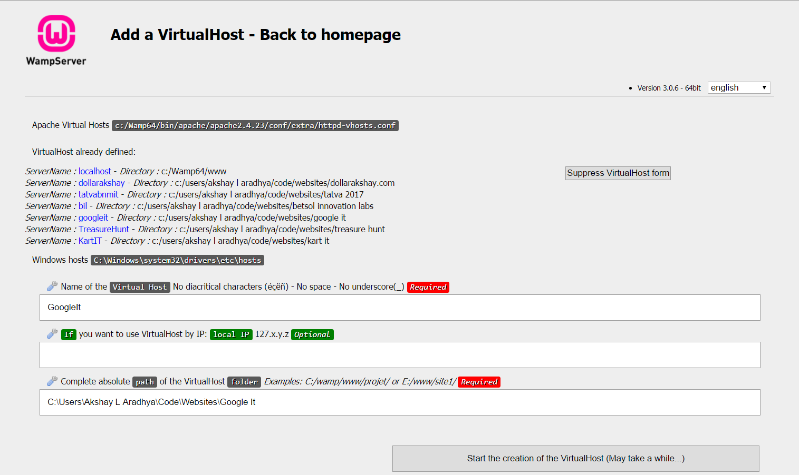

# Google-It

## Setup Instructions

1.  You can use any server of your choice, WAMP is prefered as it is simple and easy to use.   
Download and install WAMP server for your windows machine [WAMP Website](http://www.wampserver.com/en/)
1.  Download this repository and put it in a folder. I have placed all the files in `C:\Users\Akshay L Aradhya\Code\Websites\Google It`
1.  After installing WAMP server run it as Administrator. Open your browser and type `localhost` in your address bar. 
If all has gone well you should see the **WAMP SERVER Homepage**. Under **Tools** select **Add a Virtual Host**. 
Set the name of the Virtual host to `GoogleIt` and the path of the Virtual host to the folder where you have stored all the files.
It should look something like this. 
 
Now click **Start the creation of the Virtual Host** wait for it to finish and Restart WAMP Server.

